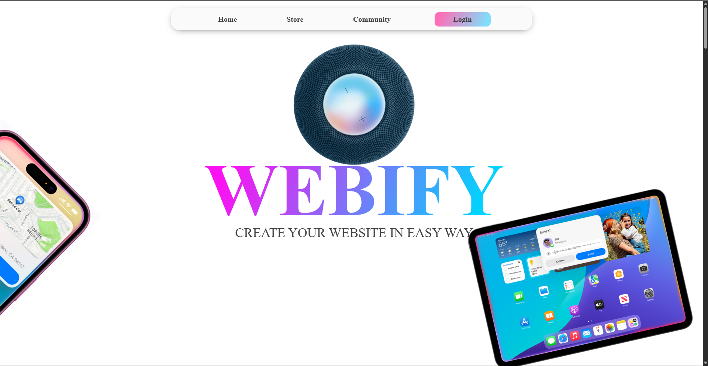
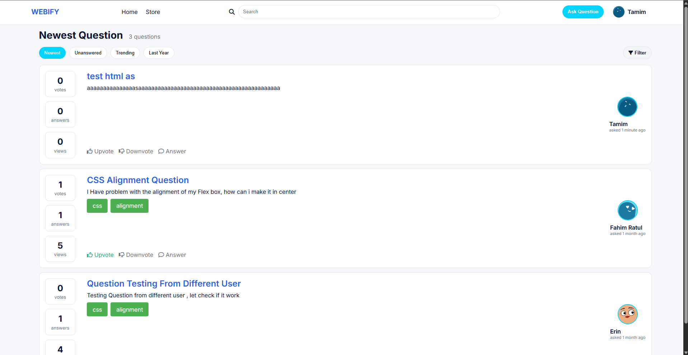
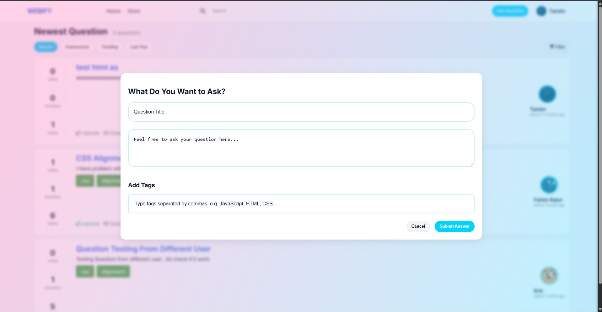
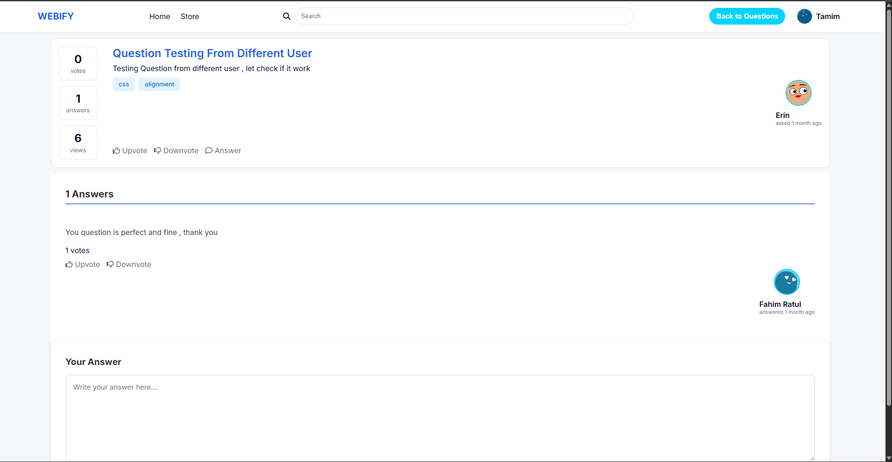

# Webify User Manual - Store and Community

---

## 1. Store (Marketplace)

### 1.1 Store Access

Purpose: Enter the Marketplace from Home and handle authentication when required.

How to Use:

1. Open the Webify Home page.
2. Click **Store** from the top navigation menu.
3. If already logged in, the Marketplace opens directly.
4. If not logged in, complete **Sign In** or **Sign Up**.
5. After successful authentication, open **Store** again to access the full Marketplace.

Expected Result:

- User reaches the Marketplace page with active browsing controls
- Template cards, filters, and search functionality are fully accessible

Figures:

- **Figure 1:** Home Page Navigation (Click Store)
  

- **Figure 2:** Authentication Window (Shown Only If User Is Not Logged In)
  

---

### 1.2 Browse, Search, and Filter Templates

Purpose: Find the right template quickly using multiple filters and search capabilities.

How to Use:

1. Use the **search bar** to find templates or components by keyword (e.g., "Dashboard", "Login Form").
2. Use **category filters:** All Designs, Free, Premium.
3. Use **type filters:** All, Dashboard, Portfolio, Webpage (or similar).
4. Use **component-name filters:** Login, Hero, Navbar, Footer, Contact Form (filters are extensible).
5. Review **card-level metrics:** number of likes, average rating, and download count.
6. Click a template card to continue to preview or details view.

Note: Component-name filter options are extensible; new component categories can be added as the library grows.

Input and Output:

- **Input:** Search term, selected category filter, selected type filter, selected component filter, and template selection
- **Output:** Filtered template list with matching templates and detailed template view when selected

Figures:

- **Figure 3:** Store Home / Marketplace Listing
  _Shows search bar, category/type filters, and template cards with engagement metrics._
  

- **Figure 3(a):** Free Category View
  _Shows only templates marked as Free._
  

- **Figure 3(b):** Premium Category View
  _Shows only templates marked as Premium (available for purchase)._
  

- **Figure 3(c):** Component Name Filter View
  _Shows templates filtered by selected component names (e.g., Login, Hero, Navbar, Footer)._
  

---

### 1.3 Template Details and Engagement

Purpose: Review full template information and interact with engagement features (likes and reviews).

How to Use:

1. Open a template details or preview view
2. Check the template **description, author, likes, rating, and download count**
3. Click **Add Like** (if not already liked)
4. Click on the **rating/review button** to submit your star rating
5. Write a brief **review comment** (optional) and submit

Input and Output:

- **Input:** Template selection, like action, review/rating submission (1-5 stars and optional text)
- **Output:** Updated engagement metrics (new like count, new rating count) and confirmation of saved feedback

Figure:

- **Figure 4:** Marketplace Item Details
  _Shows template details including engagement metrics (likes, ratings, downloads) and interactive elements._
  _Insert image: store-item-details.png_

---

### 1.4 Preview, Download, Payment, and Post-Download Review

Purpose: Execute the complete workflow for accessing free and premium templates with review submission.

How to Use:

**For Free Templates:**

1. Click **Preview** on a template card
2. Review the template content in the modal preview window
3. Click **Download**
4. The download package includes **HTML and CSS files**
5. A **star rating/review popup** appears automatically after download
6. Enter your rating (1-5 stars) and optional review comment
7. Click **Submit Review**

**For Premium Templates:**

1. Click **Preview** on a template card
2. Review the template content in the modal preview window
3. Click **Buy Now**
4. Complete the **checkout form** with payment details
5. Review the total price and terms
6. Click **Proceed to Payment** or **Pay Now**
7. After payment success, click **Download Template**
8. The premium template package is downloaded
9. A **star rating/review popup** appears automatically
10. Enter your rating (1-5 stars) and optional review comment
11. Click **Submit Review**

Input and Output:

- **Input:** Preview action, pricing-based action (Download for free / Buy Now for premium), payment details (premium only), and post-download review submission (1-5 stars + optional text)
- **Output:** Preview modal, downloaded template files (HTML/CSS), premium payment confirmation (if applicable), and stored review feedback

Figures:

- **Figure 5(a):** Free Template Preview (Download Option)
  _Shows free template preview, Download button, and post-download rating popup._
  

- **Figure 5(b):** Premium Template Preview (Buy Now Option)
  _Shows premium template preview and Buy Now entry point._
  

- **Figure 5(c):** Give Review Popup (Post-Download)
  _Shows the star-rating popup where the user submits a review after downloading a template._
  

- **Figure 5(d):** Premium Template Checkout (Payment Form)
  _Shows payment form opened after clicking Buy Now for a premium template._
  

- **Figure 5(e):** Premium Payment Success and Download
  _Shows successful payment confirmation and Download Template action._
  

---

## 2. Community

### 2.1 Community Access from Home Page

Purpose: Enter the Community module directly from the Home page.

How to Use:

1. Open the Webify Home page
2. Locate the top navigation menu
3. Click **Community**
4. If you are not logged in, complete login/sign-up and click **Community** again
5. The Community page opens with the question feed

Input and Output:

- **Input:** Click action on **Community** button
- **Output:** User is redirected to the Community page

Figure:

- **Figure 6:** Home Page - Click Community
  _Shows the Community button in top navigation from the Home page._
  

---

### 2.2 Community Question List

Purpose: Browse community questions and use the page to ask new questions and answer existing ones.

How to Use:

1. After opening Community, browse the list of posted questions
2. Use the **search bar** to find questions by keyword (e.g., "CSS Grid", "Responsive Design")
3. Use the quick category tabs to filter questions: **Newest**, **Unanswered**, **Trending**, and **Last Year**
4. Open **Filter** to use additional options like **Tag** and **Sort**
5. In the **Sort** dropdown, select ordering such as **Newest**, **Top votes**, or **Top views**
6. Click **Ask Question** (top-right) to create a new question
7. Click on a question title to open the full details and answer thread
8. Use the **Answer** action on a question to contribute your response

Input and Output:

- **Input:** Search/sort selection and question/thread click
- **Output:** Filtered question list, new question creation flow, and question detail page where users can answer

Figure:

- **Figure 7:** Community Question List
  _Shows the community page with question list, search bar, Ask Question button, and answer actions._
  

---

### 2.3 Ask a Question

Purpose: Submit a new question to the community for help and knowledge-sharing.

How to Use:

1. Click **Ask Question** button (usually at the top of the Community section)
2. Enter a **clear and descriptive title** for your question (e.g., "How to center a div using CSS Flexbox?")
3. Enter a **detailed description** with:
   - What you're trying to do
   - What you've already tried
   - Any error messages you received
   - Relevant code snippets (if applicable)
4. Add optional **tags** (e.g., "CSS", "HTML", "JavaScript") to categorize your question
5. Click **Submit** or **Post Question**
6. Your question will appear in the Community feed and community members can provide answers

Input and Output:

- **Input:** Question title, detailed description, optional tags
- **Output:** New thread entry created in the community question list

Figure:

- **Figure 8:** Ask Question Form
  _Shows the question submission form with title, description, and tag fields._
  

**Best Practices:**

- Write clear, specific titles
- Provide context and code examples
- Use appropriate tags for better visibility
- Be respectful and courteous to community members

---

### 2.4 Question Details and Interaction

Purpose: Read answers to questions, interact with community members, and help others.

How to Use:

1. Open a question details page by clicking on a question from the Community list
2. Read the **question title and original description**
3. Browse **existing answers** posted by community members
4. Review **helpful votes and ratings** on answers to identify most useful responses
5. Click **Add Answer** to contribute your own solution or knowledge
6. Write your answer in the **answer submission box**
7. Click **Submit Answer**
8. Vote on helpful answers by clicking the **upvote/like button** on any answer
9. Mark an answer as **accepted solution** (if you posted the original question)
10. Reply to specific answers using the **reply function** (if enabled)

Input and Output:

- **Input:** Answer text, interaction actions (voting, marking as solution, replying)
- **Output:** Updated thread state with new answer, updated vote count, and marked solution status

Figure:

- **Figure 9:** Community Question Details
  _Shows a question detail page with the original question, existing answers, voting buttons, and answer submission area._
  

**Community Etiquette:**

- Be respectful and helpful
- Provide complete, well-explained answers
- Use proper formatting and code blocks for code
- Search for existing answers before posting duplicates
- Thank helpful community members

---

## 3. Image Checklist

This section lists all images referenced in this manual. Ensure all images are present and correctly named:

### Store (Marketplace) Images:

- [x] store-home.png.png (Figure 1 - Home Page Navigation)
- [x] store-auth-login.png.png (Figure 2 - Authentication Window)
- [x] store-listing-page.png.png (Figure 3 - Marketplace Listing)
- [x] store-free-view.png.png (Figure 3a - Free Category View)
- [x] store-premium-view.png.png (Figure 3b - Premium Category View)
- [x] store-component-filter-view.png.png (Figure 3c - Component Filter View)
- [ ] store-item-details.png (Figure 4 - Template Details)
- [x] store-preview-free.png.png (Figure 5a - Free Template Preview)
- [x] store-preview-premium.png.png (Figure 5b - Premium Template Preview)
- [x] review.png.png (Figure 5c - Review Popup)
- [x] store-premium-checkout.png.png (Figure 5d - Premium Checkout)
- [x] store-premium-payment-success.png.png (Figure 5e - Payment Success)

### Community Images:

- [x] community-home-navigation.png.png (Figure 6 - Home Page Community Access)
- [x] community-list.png.png (Figure 7 - Community Question List)
- [x] community-ask-question.png.png (Figure 8 - Ask Question Form)
- [x] community-question-details.png.png (Figure 9 - Question Details)

**Legend:**

- [x] Image file exists and is embedded
- [ ] Image file needed (placeholder currently in document)

---

**End of User Manual - Store and Community**
