# Webify User Manual (Store and Community)

## Document Info

- Project: Webify
- Module Scope: Store (Marketplace) and Community
- Author: [Your Name]
- Date: March 31, 2026

---

## 1 Store (Marketplace)

### 1.1 Store Access

Purpose: Enter the Marketplace from Home and handle authentication when required.

How to Use:

1. Open the Webify Home page.
2. Click Store from the top navigation.
3. If already logged in, Marketplace opens directly.
4. If not logged in, complete Sign In or Sign Up.
5. After successful authentication, open Store again.

Expected Result:

- User reaches the Marketplace page with active browsing controls.

Figures:

- **Figure 1:** Home Page Navigation (Click Store)
  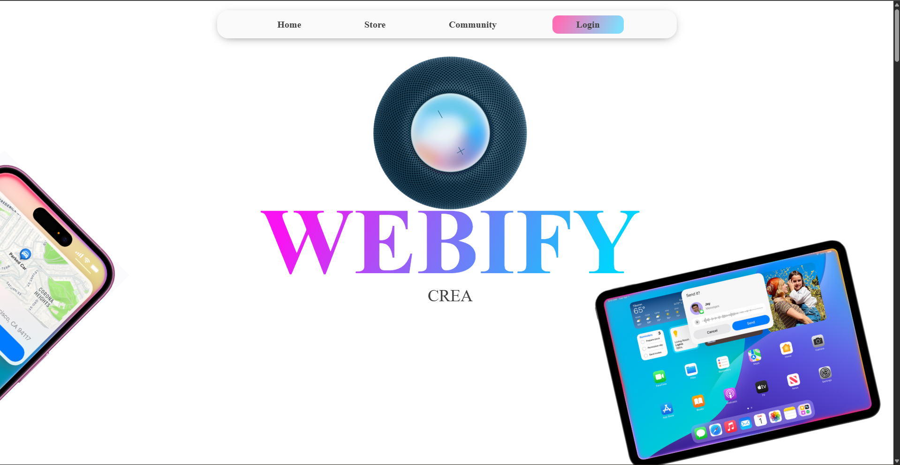

- **Figure 2:** Authentication Window (Shown Only If User Is Not Logged In)
  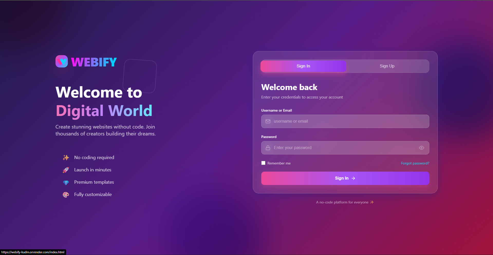

### 1.2 Browse, Search, and Filter Templates

Purpose: Find the right template quickly using multiple filters.

How to Use:

1. Use the search bar to find templates/components by keyword.
2. Use category filters: All Designs, Free, Premium.
3. Use type filters such as All, Dashboard, Portfolio, Webpage.
4. Use component-name filters (for example: Login, Hero, Navbar, Footer).
5. Review card-level metrics: likes, average rating, and downloads.
6. Click a template to continue to preview/details.

Note: Component-name filter options are extensible; new component categories can be added later.

Input and Output:

- Input: Search term, selected category filter, selected type filter, selected component filter, and template selection.
- Output: Filtered template list and selected template view.

Figures:

- **Figure 3:** Store Home / Marketplace Listing
  _Shows search bar, category/type filters, and template cards._
  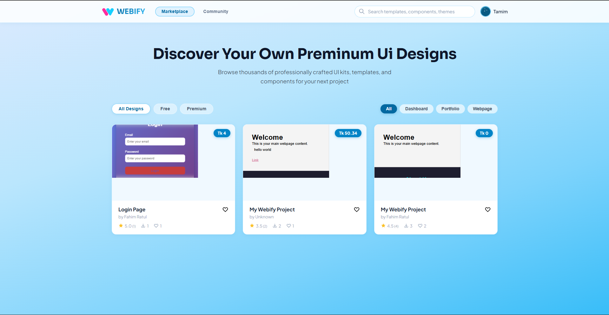

- **Figure 3(a):** Free Category View
  _Shows only templates listed under the Free category filter._
  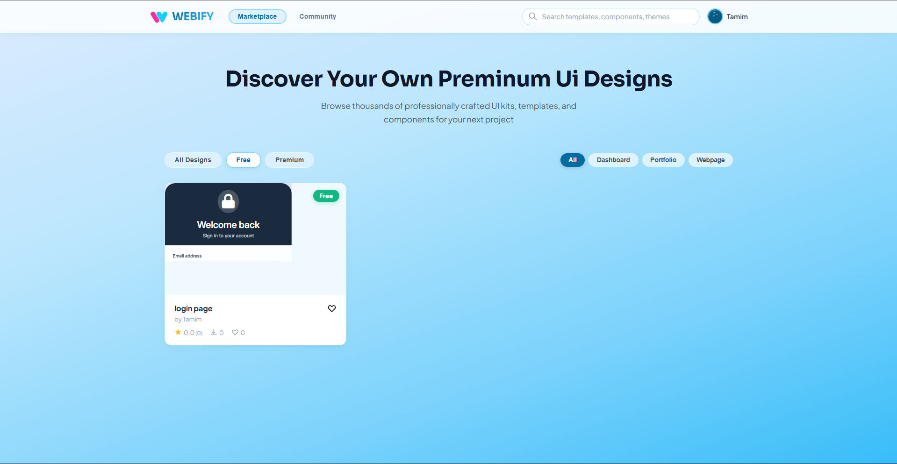

- **Figure 3(b):** Premium Category View
  _Shows only templates listed under the Premium category filter._
  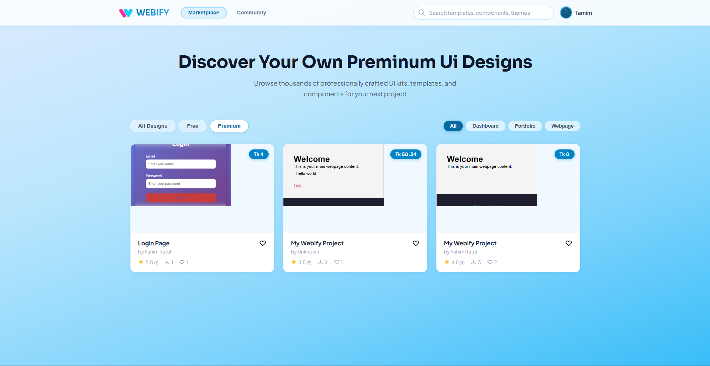

- **Figure 3(c):** Component Name Filter View
  _Shows templates filtered by selected component names (for example: Login, Hero, Navbar, Footer)._
  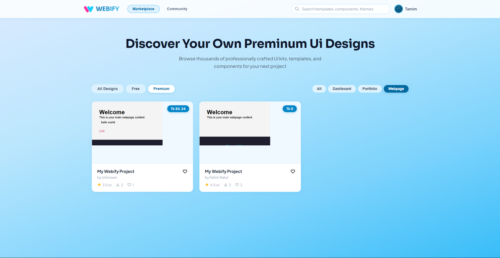

### 1.3 Template Details and Engagement

Purpose: Review full template information and interact with engagement features.

How to Use:

1. Open a template details/preview view.
2. Check description, author, likes, rating, and download count.
3. Add Like (if not already liked).
4. Submit review/rating when prompted.

Input and Output:

- Input: Template selection, like action, review/rating submission.
- Output: Updated engagement metrics and saved user feedback.

Figure:

- **Figure 4:** Marketplace Item Details
  _Insert image: store-item-details.png_

### 1.4 Preview, Download, Payment, and Post-Download Review

Purpose: Execute the complete access flow for free and premium templates.

How to Use:

1. Click Preview on a template card.
2. Review template content in modal preview.
3. For Free templates:
   - Click Download.
   - Download package includes HTML and CSS files.
   - Submit star rating/review when the review popup appears.
4. For Premium templates:
   - Click Buy Now.
   - Complete checkout/payment form.
   - After payment success, click Download Template.
   - Submit star rating/review when review popup appears.

Input and Output:

- Input: Preview action, pricing-based action (Download/Buy Now), payment details (premium only), and post-download review submission.
- Output: Preview modal, downloaded template files, premium payment confirmation (if applicable), and stored review feedback.

Figures:

- **Figure 5(a):** Free Template Preview (Download Option)
  _Shows free template preview, Download action, and post-download rating popup._
  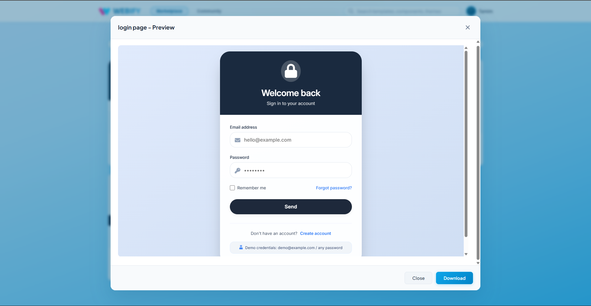

- **Figure 5(b):** Premium Template Preview (Buy Now Option)
  _Shows premium template preview and Buy Now entry point._
  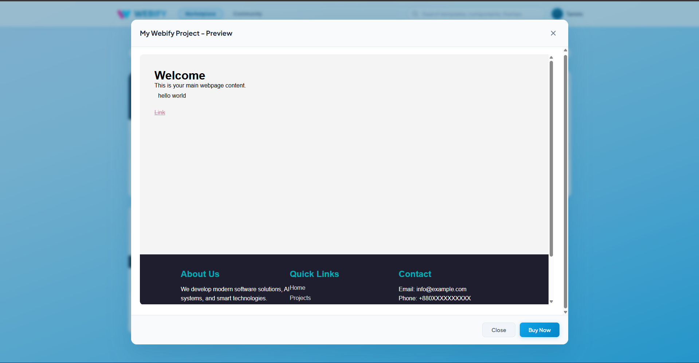

- **Figure 5(c):** Give Review Popup (Post-Download)
  _Shows the star-rating popup where the user submits review after download._
  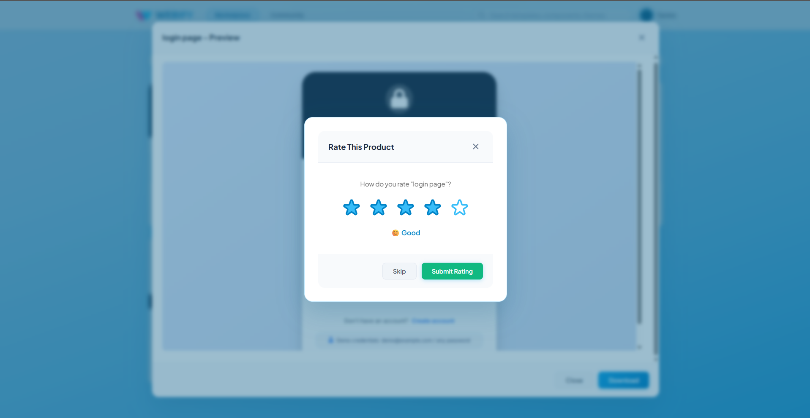

- **Figure 5(d):** Premium Template Checkout (Payment Form)
  _Shows payment form opened after clicking Buy Now for a premium template._
  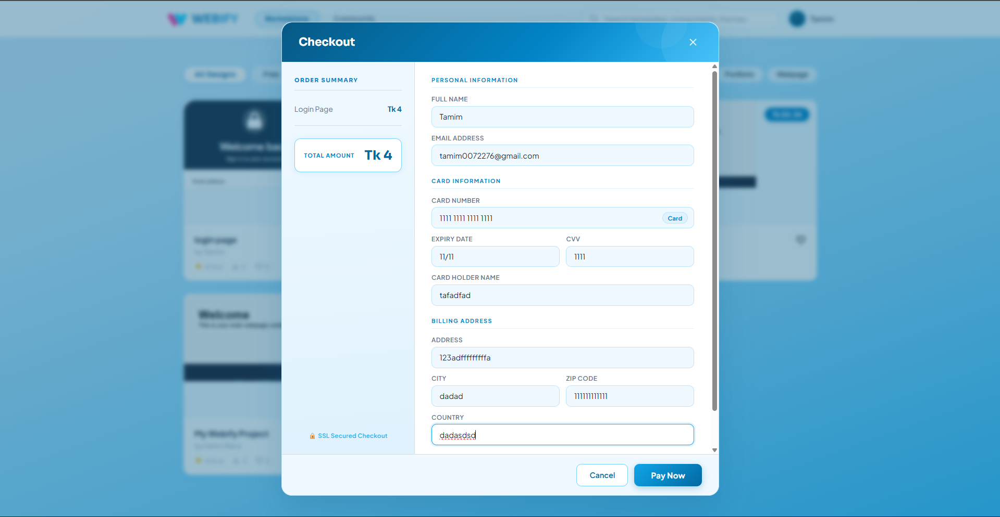

- **Figure 5(e):** Premium Payment Success and Download
  _Shows successful payment confirmation and Download Template action._
  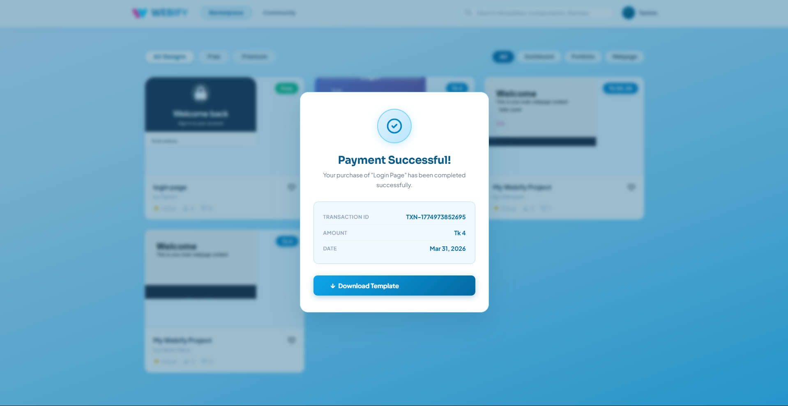

---

## 2 Community

### 2.1 Community Question List

Purpose: Browse support questions and known solutions.

How to Use:

1. Navigate to Community.
2. Browse thread list.
3. Use search/sort controls.
4. Open a thread for full details.

Input and Output:

- Input: Search/sort selection and thread click.
- Output: Filtered list and selected thread page.

Figure:

- **Figure 6:** Community Question List
  _Insert image: community-list.png_

### 2.2 Ask a Question

Purpose: Submit a new question to community.

How to Use:

1. Click Ask Question.
2. Enter title and detailed description.
3. Submit the form.

Input and Output:

- Input: Question title and body.
- Output: New thread entry in community.

Figure:

- **Figure 7:** Ask Question Form
  _Insert image: community-ask-question.png_

### 2.3 Question Details and Interaction

Purpose: Read and interact with answers on a question.

How to Use:

1. Open a question detail page.
2. Review existing answers.
3. Add answer/reply (if enabled).
4. Use vote/interaction controls (if enabled).

Input and Output:

- Input: Answer text and interaction actions.
- Output: Updated thread state (new answer/votes).

Figure:

- **Figure 8:** Community Question Details
  _Insert image: community-question-details.png_

---

## 3 Image Checklist

Add these images when available:

- store-home.png.png
- store-auth-login.png.png
- store-listing-page.png.png
- store-free-view.png.png
- store-premium-view.png.png
- store-component-filter-view.png.png
- store-item-details.png
- store-preview-free.png.png
- store-preview-premium.png.png
- review.png.png
- store-premium-checkout.png.png
- store-premium-payment-success.png.png
- community-list.png
- community-ask-question.png
- community-question-details.png
